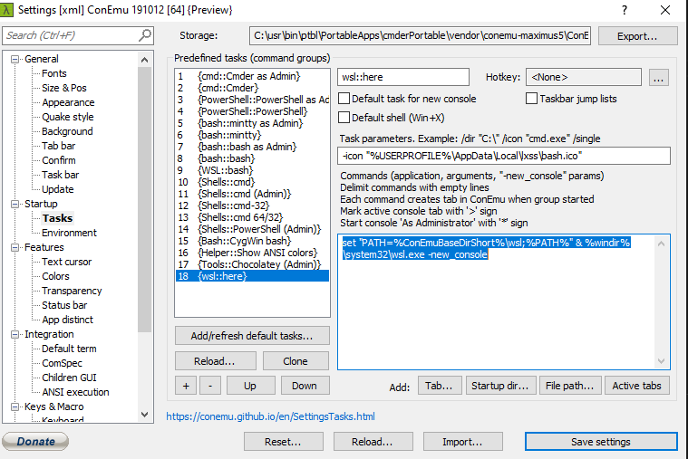

Settings for various systems in localdev.md

# CMDER
## WSL Console
CMDer settings to start a new WSL console. [Source](https://shesgottadevelopit.com/2018/12/05/wsl-cmder-context-menu/)
Task Parameters
```-icon "%USERPROFILE%\AppData\Local\lxss\bash.ico"```
Start Console
```set "PATH=%ConEmuBaseDirShort%\wsl;%PATH%" & %windir%\system32\wsl.exe -new_console'```


