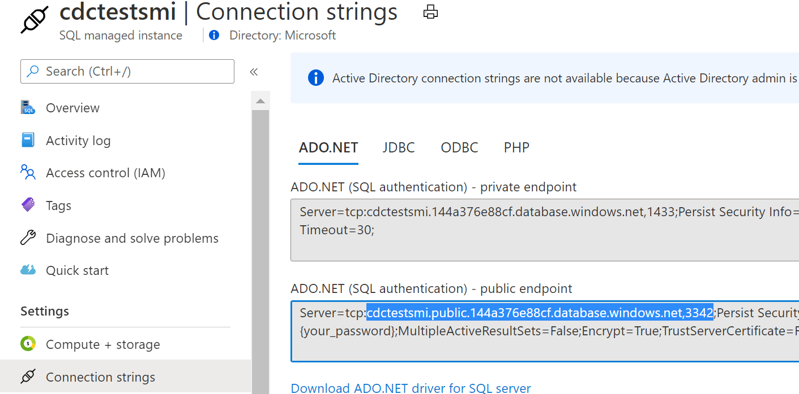
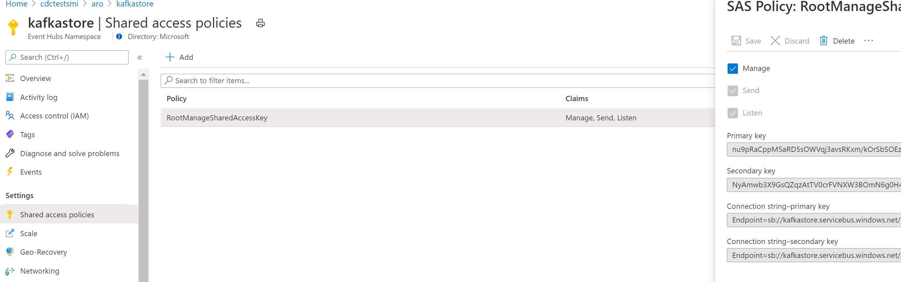
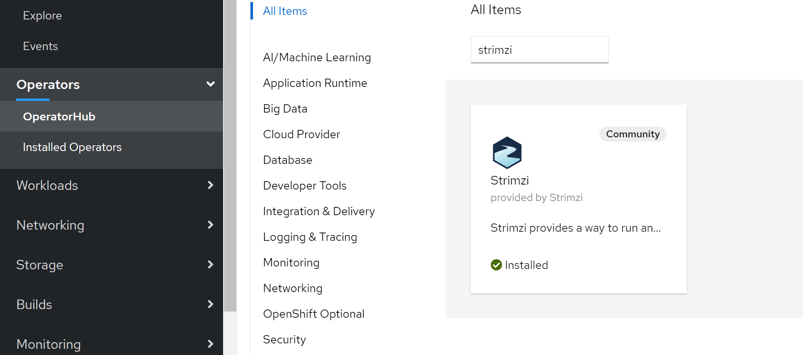
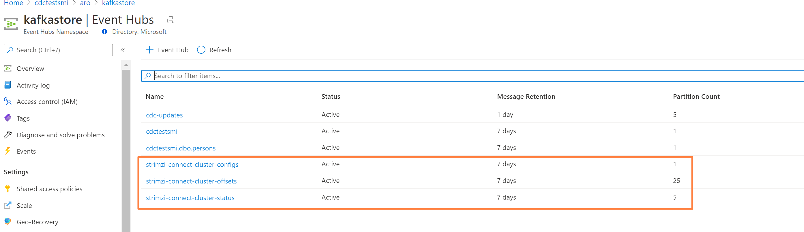
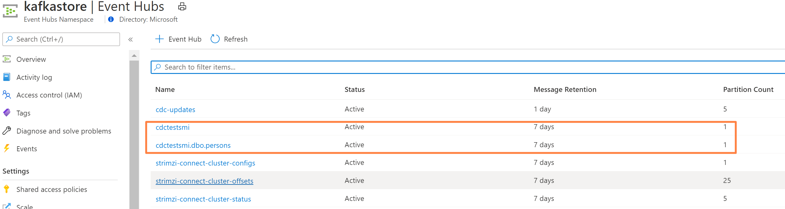

Original files based on a split from this github repository https://github.com/lenisha/aks-tests/tree/master/oshift/strimzi-kafka-connect-eventhubs

# TODO 
- placeholder

# Streaming CDC changes to Azure Event Hubs using Strimzi and Debezium

Table of contents
=================

<!--ts-->
   * [Create SQL DB and enable CDC](#create-sql-db-and-enable-cdc)
   * [Create Azure EventHubs](#create-azure-eventhubs)
   * [Install Strimzi Kafka Operator](#install-strimzi-operator)
   * [Prepare KafkaConnect Image with Debezium Plugin](#prepare-kafka-connect-image-with-debezium-plugin)
   * [Install KafkaConnect](#install-kafka-connect)
   * [Install Debezium SQL Connector](#install-debezium-sql-connector)
   * [Test](#test)
 <!--te-->

# Create SQL DB and enable CDC
This test used Azure SQL MI instance and as per docs on Debezium (Azure SQL is not yet supported)

- Create Azure SQL MI instance with Public endpoint, make sure port 3342 is enabled on NSG rules for access, get connection string for public endpoint


- Enable CDC Capture as per docs: [CDC with ADF ](https://docs.microsoft.com/en-us/azure/data-factory/tutorial-incremental-copy-change-tracking-feature-portal)

```sql
create table Persons
(
    PersonID int NOT NULL,
    Name varchar(255),
    Age int
    PRIMARY KEY (PersonID)
);

INSERT INTO Persons (PersonID,Name, Age) VALUES (1, 'Erichsen', 35);
INSERT INTO Persons (PersonID,Name, Age) VALUES (2, 'Kane', 25);

EXEC sys.sp_cdc_enable_db 

EXEC sys.sp_cdc_enable_table
@source_schema = 'dbo',
@source_name = 'Persons', 
@role_name = 'null',
@supports_net_changes = 1
```

## Create Azure EventHubs

We will use Azure EventHubs as Kafka broker and integrate it with Kafka Connect to stream data.

Create Azure EventHubs and take note of access keys



## Install Strimzi Operator
KafkaConnect with its connectors could be used as a middleman that would stream CDC events to Azure EventHubs Broker.
To install Kafka connect we will use popular Strimzi operator but will only use CRDs to setup KafkaConnect and KafkaConnect SQL Connector.

- Option 1. Install from OperatorsHub  


- Option2. Install operator using Helm or YAML manifests
Described in  [Kafka Connect the eay way](https://itnext.io/kafka-connect-on-kubernetes-the-easy-way-b5b617b7d5e9)
```sh
//add helm chart repo for Strimzi
helm repo add strimzi https://strimzi.io/charts/
//install it! (I have used strimzi-kafka as the release name)
helm install strimzi-kafka strimzi/strimzi-kafka-operator
```
or [Running Debezium on OpenShift](https://debezium.io/documentation/reference/operations/openshift.html)

```sh
export STRIMZI_VERSION=0.20.0
git clone -b $STRIMZI_VERSION https://github.com/strimzi/strimzi-kafka-operator
cd strimzi-kafka-operator

# Switch to an admin user to create security objects as part of installation:
oc login -u system:admin
oc create -f install/cluster-operator && oc create -f examples/templates/cluster-operator
```

# Prepare Kafka Connect Image with Debezium Plugin

KafkaConnect Loads Connectors from its internal `plugin.path`. Debezium is the most popular connector for CDC capture from various Databases.

The default KafkaConnect image does not include Debezium connector so we need extend the image. `Dockerfile` in this repo demonstrates the technique. Note for Debezium some connector version may have issues with your environment and require changing the version to have it work. The following Dockerfile use base image version that the installed Operator supports:

```Dockerfile
FROM strimzi/kafka:0.20.0-kafka-2.5.0
USER root:root
RUN mkdir -p /opt/kafka/plugins/debezium

# DOWNLOAD and copy connector
RUN curl https://repo1.maven.org/maven2/io/debezium/debezium-connector-sqlserver/1.3.0.Final/debezium-connector-sqlserver-1.3.0.Final-plugin.tar.gz | tar xvz
RUN mv ./debezium-connector-sqlserver/* /opt/kafka/plugins/debezium/ 
    
USER 1001
```

Buid and push the image (sample is using my repo on dockerhub)
```
docker build -t lenisha/kafka-connect-debezium:2.5.0-1.3.0 .
docker push lenisha/kafka-connect-debezium:2.5.0-1.3.0
```

## Install Kafka Connect

**Note:** all examples use kubernetes namespace `cdc-kafka`

Now we need to setup KafkaConnect worker to be able to talk to Azure EventHubs as a broker.
- Create a secret to hold AzureEventHubs auth details, replace in this yaml file `eventhubspassword` with your EventHubs Keys and apply:
`oc apply -f eventhubs-secret.yaml`

- Create Credentials for Connector to authenticate to Azure SQL MI, replace in `sqlserver-credentials.properties` fields for `database.password` and user and create a secret:

```sh
oc -n cdc-kafka create secret generic sql-credentials --from-file=sqlserver-credentials.properties
```

- Create KafkaConnect worker Cluster, using the image that was created in the step above


```yaml
apiVersion: kafka.strimzi.io/v1beta1
kind: KafkaConnect
metadata:
  name: kafka-connect-cluster-debezium
  annotations:
    strimzi.io/use-connector-resources: "true"
spec:
  replicas: 1
  bootstrapServers: kafkastore.servicebus.windows.net:9093
  image: lenisha/kafka-connect-debezium:2.5.0-1.3.0
  version: 2.5.0
  config:
    group.id: connect-cluster
    offset.storage.topic: strimzi-connect-cluster-offsets
    config.storage.topic: strimzi-connect-cluster-configs
    status.storage.topic: strimzi-connect-cluster-status
    config.storage.replication.factor: 1
    offset.storage.replication.factor: 1
    status.storage.replication.factor: 1
    config.providers: file
    config.providers.file.class: org.apache.kafka.common.config.provider.FileConfigProvider
  authentication:
    type: plain
    username: $ConnectionString
    passwordSecret:
      secretName: eventhubssecret
      password: eventhubspassword
  tls:
    trustedCertificates: []
  logging:
    type: inline
    loggers:
      rootLogger.level: DEBUG
  resources:
    requests:
      cpu: "1"
      memory: 2Gi
    limits:
      cpu: "2"
      memory: 2Gi    
  jvmOptions: 
    "-Xmx": "1g"
    "-Xms": "1g"
  readinessProbe: 
    initialDelaySeconds: 15
    timeoutSeconds: 5
  livenessProbe:
    initialDelaySeconds: 15
    timeoutSeconds: 5  

  externalConfiguration:
    volumes:
      - name: connector-config
        secret:
          secretName: sql-credentials  
```

update:
- `bootstrapServers` to point to your AzureEventHubs namespace
- `image` with your connector image

- Apply the manifest
```sh
oc apply -f kafka-connect.yaml -n cdc-kafka
```

- Verify that KafkaConnect Cluster is running

```sh
$ oc get pods -n cdc-kafka
NAME                                                     READY   STATUS    RESTARTS   AGE
kafka-connect-cluster-debezium-connect-bdd84fd96-vj2p9   1/1     Running   0          33m
strimzi-cluster-operator-v0.19.0-7d4f9f5cbf-cxxlx        1/1     Running   0          14h

$ oc get svc -n cdc-kafka
NAME                                         TYPE        CLUSTER-IP       EXTERNAL-IP   PORT(S)    AGE
kafka-connect-cluster-debezium-connect-api   ClusterIP   172.30.109.146   <none>        8083/TCP   33m
```

Connect to the KafkaConnect Server and verify that SQl Connector plugin is loaded and available:
```sh
oc exec -i -n cdc-kafka kafka-connect-cluster-debezium-connect-6668b7d974-wcgnf -- curl -X GET http://kafka-connect-cluster-debezium-connect-api:808
3/connector-plugins | jq .

[
  {
    "class": "io.debezium.connector.sqlserver.SqlServerConnector",
    "type": "source",
    "version": "1.3.0.Final"
  },
  {
    "class": "org.apache.kafka.connect.file.FileStreamSinkConnector",
    "type": "sink",
    "version": "2.5.0"
  },
  {
    "class": "org.apache.kafka.connect.file.FileStreamSourceConnector",
    "type": "source",
    "version": "2.5.0"
  },
  {
    "class": "org.apache.kafka.connect.mirror.MirrorCheckpointConnector",
    "type": "source",
    "version": "1"
  },
  {
    "class": "org.apache.kafka.connect.mirror.MirrorHeartbeatConnector",
    "type": "source",
    "version": "1"
  },
  {
    "class": "org.apache.kafka.connect.mirror.MirrorSourceConnector",
    "type": "source",
    "version": "1"
  }
]

```

Once the KafkaConnect Cluster started it will create topics for its internal operations:


## Install Debezium SQL Connector

Now we will configure and  install SQLConnector instance. It's typically done using REST api but Strimzi Operator automated it using K8S CRD objects.

Make sure `labels` is pointing to the KafkaConnect cluster we created in the step above

```yaml
apiVersion: kafka.strimzi.io/v1alpha1
kind: KafkaConnector
metadata:
  name: azure-sql-connector
  labels:
    strimzi.io/cluster: kafka-connect-cluster-debezium
spec:
  class: io.debezium.connector.sqlserver.SqlServerConnector
  tasksMax: 1
  config:
    database.hostname: "cdctestsmi.public.144a376e88cf.database.windows.net" 
    database.port: "3342"
    database.dbname: "cdcKafka"
    database.server.name: "cdctestsmi"
    database.user: ${file:/opt/kafka/external-configuration/connector-config/sqlserver-credentials.properties:database.user}
    database.password: ${file:/opt/kafka/external-configuration/connector-config/sqlserver-credentials.properties:database.password}
    table.include.list: "dbo.Persons"
    database.history.kafka.topic: "cdc-updates"
    include.schema.changes: "true" 
    database.history: "io.debezium.relational.history.MemoryDatabaseHistory"
    errors.log.enable: "true"
```

- replace `database.hostname`, `database.dbname` and `database.server.name` with details of your SQL Server

and install and verify the connector is up and running:

```sh
> oc apply -f sqlserver-connector.yaml -n cdc-kafka
> oc get kctr azure-sql-connector -o yaml -n cdc-kafka

apiVersion: kafka.strimzi.io/v1alpha1
kind: KafkaConnector
metadata:
status:
  connectorStatus:
    connector:
      state: RUNNING
      worker_id: 10.129.2.28:8083
    name: azure-sql-connector
    tasks:
    - id: 0
      state: RUNNING
      worker_id: 10.129.2.28:8083
    type: source
  observedGeneration: 1
  tasksMax: 1
```

and verify using Connect API:

```sh
oc exec -i -n cdc-kafka  kafka-connect-cluster-debezium-connect-5d96664b98-tn5j7 -- curl -X GET http://kafka-connect-cluster-debezium-connect-api:8083/c
onnectors | jq .
 
[
  "azure-sql-connector"
]
```

## Test

Debezium SQL Connector creates topics for schema and table updates:



For testing we will use `kafkacat` to monitor the Azure Event Hubs.


- configure the connection details for `kafkacat` in `~/.config/kafkacat.conf` 

```properties
metadata.broker.list=kafkastore.servicebus.windows.net:9093
security.protocol=SASL_SSL
sasl.mechanisms=PLAIN
sasl.username=$ConnectionString
sasl.password=Endpoint=sb://kafkastore.servicebus.windows.net/;SharedAccessKeyName=RootManageSharedAccessKey;SharedAccessKey=xxxx
socket.timeout.ms=30000
metadata.request.timeout.ms=30000
```

- Listen to topic for events from Azure Event Hubs, topic name is in pattern `servername.dbtable`

```sh
kafkacat -C -b kafkastore.servicebus.windows.net:9093 -t cdctestsmi.dbo.Persons -o beginning
```

- insert the data into the `Persons` table
```sql
INSERT INTO Persons (PersonID,Name, Age) VALUES (7, 'Targarien', 125);
```

And see the event apper in the topic:
```json
{"schema":{"type":"struct","fields":[{"type":"struct","fields":[{"type":"int32","optional":false,"field":"PersonID"},{"type":"string","optional":true,"field":"Name"},{"type":"int32","optional":true,"field":"Age"}],"optional":true,"name":"cdctestsmi.dbo.Persons.Value","field":"before"},{"type":"struct","fields":[{"type":"int32","optional":false,"field":"PersonID"},{"type":"string","optional":true,"field":"Name"},{"type":"int32","optional":true,"field":"Age"}],"optional":true,"name":"cdctestsmi.dbo.Persons.Value","field":"after"},{"type":"struct","fields":[{"type":"string","optional":false,"field":"version"},{"type":"string","optional":false,"field":"connector"},{"type":"string","optional":false,"field":"name"},{"type":"int64","optional":false,"field":"ts_ms"},{"type":"string","optional":true,"name":"io.debezium.data.Enum","version":1,"parameters":{"allowed":"true,last,false"},"default":"false","field":"snapshot"},{"type":"string","optional":false,"field":"db"},{"type":"string","optional":false,"field":"schema"},{"type":"string","optional":false,"field":"table"},{"type":"string","optional":true,"field":"change_lsn"},{"type":"string","optional":true,"field":"commit_lsn"},{"type":"int64","optional":true,"field":"event_serial_no"}],"optional":false,"name":"io.debezium.connector.sqlserver.Source","field":"source"},{"type":"string","optional":false,"field":"op"},{"type":"int64","optional":true,"field":"ts_ms"},{"type":"struct","fields":[{"type":"string","optional":false,"field":"id"},{"type":"int64","optional":false,"field":"total_order"},{"type":"int64","optional":false,"field":"data_collection_order"}],"optional":true,"field":"transaction"}],"optional":false,"name":"cdctestsmi.dbo.Persons.Envelope"},"payload":{
    "before":null,
    "after":{"PersonID":7,"Name":"Targarien","Age":125},
    "source":{"version":"1.3.0.Final","connector":"sqlserver","name":"cdctestsmi","ts_ms":1603986207443,"snapshot":"false","db":"cdcKafka","schema":"dbo","table":"Persons","change_lsn":"0000002b:000004f8:0004","commit_lsn":"0000002b:000004f8:0005","event_serial_no":1},"op":"c","ts_ms":1603986211338,"transaction":null}}
```

## Troubleshooting

To see the output of the SQL Connector and KafkaConnect monitor the logs:

```sh
 oc logs kafka-connect-cluster-debezium-connect-5d96664b98-tn5j7 -n cdc-kafka --tail 200 -f
```

You could dynamically change verbosity for the various components as described in this article: [Changing KafkaConnect logging dynamically](https://rmoff.net/2020/01/16/changing-the-logging-level-for-kafka-connect-dynamically/)

```sh
# exec into the pod
oc exec -it -n cdc-kafka kafka-connect-cluster-debezium-connect-6668b7d974-wcgnf -- sh

#change log level
curl -s -X PUT -H "Content-Type:application/json"  http://kafka-connect-cluster-debezium-connect-api:8083/admin/loggers/io.debezium -d '{"level": "TRACE"}'
curl -s -X PUT -H "Content-Type:application/json"  http://kafka-connect-cluster-debezium-connect-api:8083/admin/loggers/org.apache.kafka.connect.runtime.WorkerSourceTask -d '{"level": "TRACE"}'
curl -s -X PUT -H "Content-Type:application/json"  http://kafka-connect-cluster-debezium-connect-api:8083/admin/loggers/org.apache.kafka.clients.NetworkClient -d '{"level": "DEBUG"}'
```

Known bugs with history table and workaround:

https://github.com/Azure/azure-event-hubs-for-kafka/issues/53

https://github.com/Azure/azure-event-hubs-for-kafka/issues/61

# Appendix - Example Openshift Settings

## Details

Configuration and Envrionment details for a Openshift deployment
Pod scaling is 1

```
Selectors:
    strimzi.io/cluster=connect-cluster-debezium
    strimzi.io/kind=KafkaConnect
    strimzi.io/name=connect-cluster-debezium-connect
Replicas:
    1 replica
Strategy:
    Rolling update
Max Unavailable:
    0 
Max Surge:
    1 
Min Ready:
    0 sec 
Revision History Limit:
    10 
Progress Deadline:
    600 sec 

Template
Containers
connect-cluster-debezium-connect
Image: <org name>/strimzi-kafka-connect-debezium:2.5.0-1.2.5 <versions of strimzi kafka connect and debezium connector used>
Command: /opt/kafka/kafka_connect_run.sh
Ports: 8083/TCP (rest-api)
Mount: kafka-metrics-and-logging → /opt/kafka/custom-config/ read-write
Mount: deveventhubssecret → /opt/kafka/connect-password/deveventhubssecret read-write
Mount: ext-conf-connector-config → /opt/kafka/external-configuration/connector-config read-write
CPU: 1 core to 2 cores
Memory: 2 GiB to 2 GiB
Readiness Probe: GET / on port rest-api (HTTP) 15s delay, 5s timeout
Liveness Probe: GET / on port rest-api (HTTP) 15s delay, 5s timeout
Volumes

kafka-metrics-and-logging 
Type:
    config map (populated by a config map) 
Config Map:
    connect-cluster-debezium-connect-config

deveventhubssecret 
Type:
    secret (populated by a secret when the pod is created) 
Secret:
    deveventhubssecret 

ext-conf-connector-config 
Type:
    secret (populated by a secret when the pod is created) 
Secret:
    sql-credentials 
```

## Environment Settings
```
- KAFKA_CONNECT_CONFIGURATION = offset.storage.topic=connect-cluster-offsetsvalue.converter=org.apache.kafka.connect.json.JsonConverterconfig.storage.topic=connect-cluster-configskey.converter=org.apache.kafka.connect.json.JsonConvertergroup.id=connect-clusterstatus.storage.topic=connect-cluster-statusconfig.providers=fileconfig.providers.file.class=org.apache.kafka.common.config.provider.FileConfigProviderconfig.storage.replication.factor=1key.converter.schemas.enable=falseoffset.storage.replication.factor=1status.storage.replication.factor=1value.converter.schemas.enable=false
- KAFKA_CONNECT_METRICS_ENABLED = false
- KAFKA_CONNECT_BOOTSTRAP_SERVERS = <set to Event Hub address
- STRIMZI_KAFKA_GC_LOG_ENABLED = false
- KAFKA_HEAP_OPTS = -Xms1g -Xmx1g
- KAFKA_CONNECT_TLS = true
- KAFKA_CONNECT_SASL_USERNAME = $ConnectionString
- KAFKA_CONNECT_SASL_MECHANISM = plain
- KAFKA_CONNECT_SASL_PASSWORD_FILE = <set to secret and its variable name stored in Kubernetes>
```
